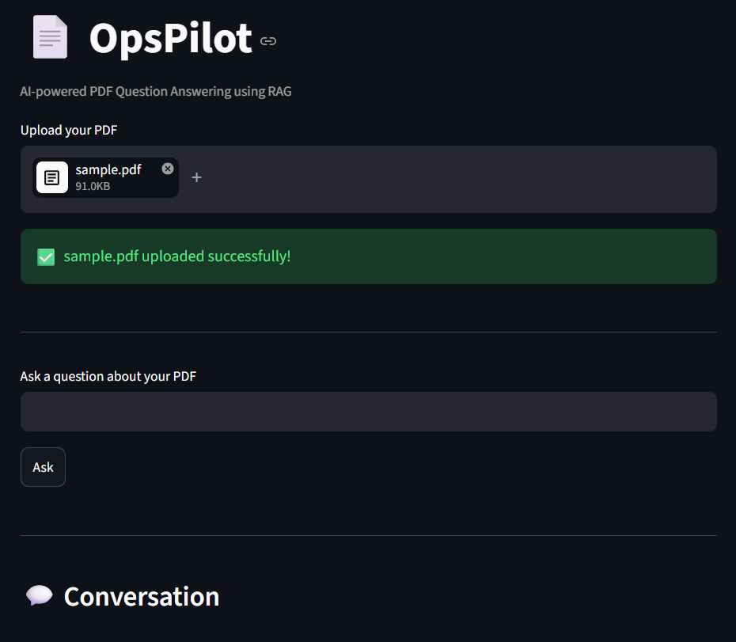
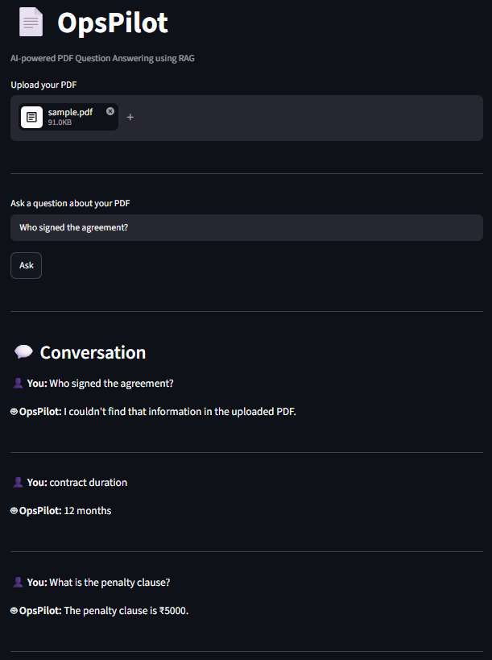

# 📄 OpsPilot

An AI-powered PDF Question Answering application built using **Retrieval-Augmented Generation (RAG)**. Users can upload a PDF document and ask natural language questions about its contents. The system retrieves the most relevant text from the document using FAISS and generates accurate answers using Google's Gemini model.

---

## ✨ Features

- 📂 Upload PDF documents
- 📖 Extract text using PyMuPDF
- ✂️ Split documents into chunks
- 🧠 Generate embeddings
- 🔍 Store embeddings in FAISS
- 🤖 Answer questions using Google Gemini
- 💬 Chat-style conversation history
- ⚡ FastAPI backend
- 🎨 Streamlit frontend

---

## 🛠 Tech Stack

- Python 3.12
- FastAPI
- Streamlit
- LangChain
- FAISS
- Google Gemini API
- PyMuPDF

---

## 📂 Project Structure

```
OpsPilot/
│
├── backend/
│   ├── main.py
│   ├── rag.py
|   ├── llm.py
│   ├── pdf_loader.py
│   ├── requirements.txt
│   └── .env.example
│
├── frontend/
│   └── app.py
│
├── uploads/
│
├── README.md
└── .gitignore
```

---

## ⚙️ Installation

### Clone Repository

```bash
git clone https://github.com/<your-username>/OpsPilot.git

cd OpsPilot
```

### Create Virtual Environment

```bash
python -m venv venv
```

### Activate

Windows

```bash
venv\Scripts\activate
```

Linux/Mac

```bash
source venv/bin/activate
```

### Install Dependencies

```bash
pip install -r backend/requirements.txt
```

---

## 🔑 Environment Variables

Create a `.env` file inside the `backend` folder.

```env
GOOGLE_API_KEY=YOUR_API_KEY
```

---

## ▶️ Run Backend

```bash
cd backend

uvicorn main:app --reload
```

---

## ▶️ Run Frontend

Open another terminal.

```bash
cd frontend

streamlit run app.py
```

---

## 📷 Screenshots

### Upload PDF



### Ask Questions



---

## 🚀 Future Improvements

- Multiple PDF support
- Source citation
- Authentication
- Chat memory across sessions
- Deployment using Docker

---

## 👨‍💻 Author

**Rishabh Gupta**

B.Tech – Computer Science & Engineering
